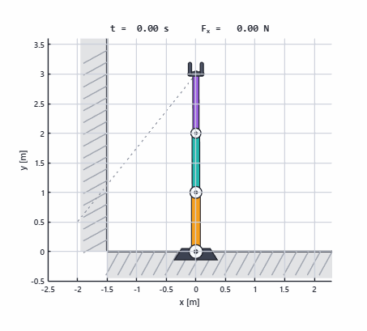
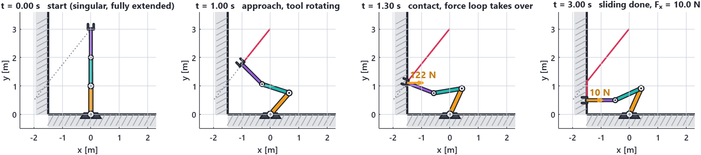
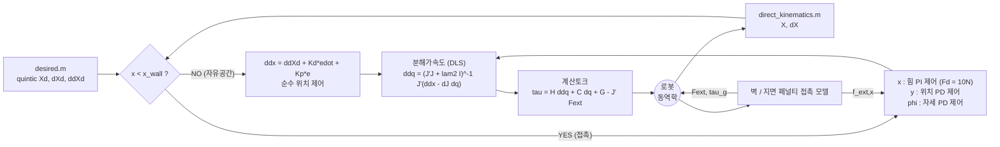
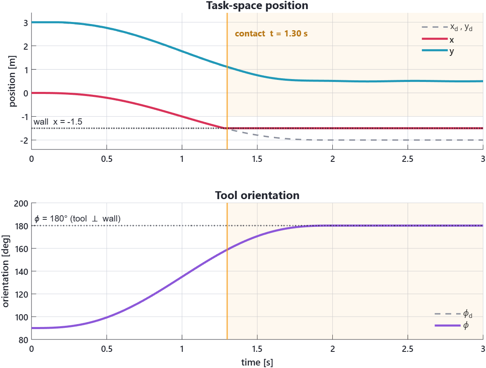
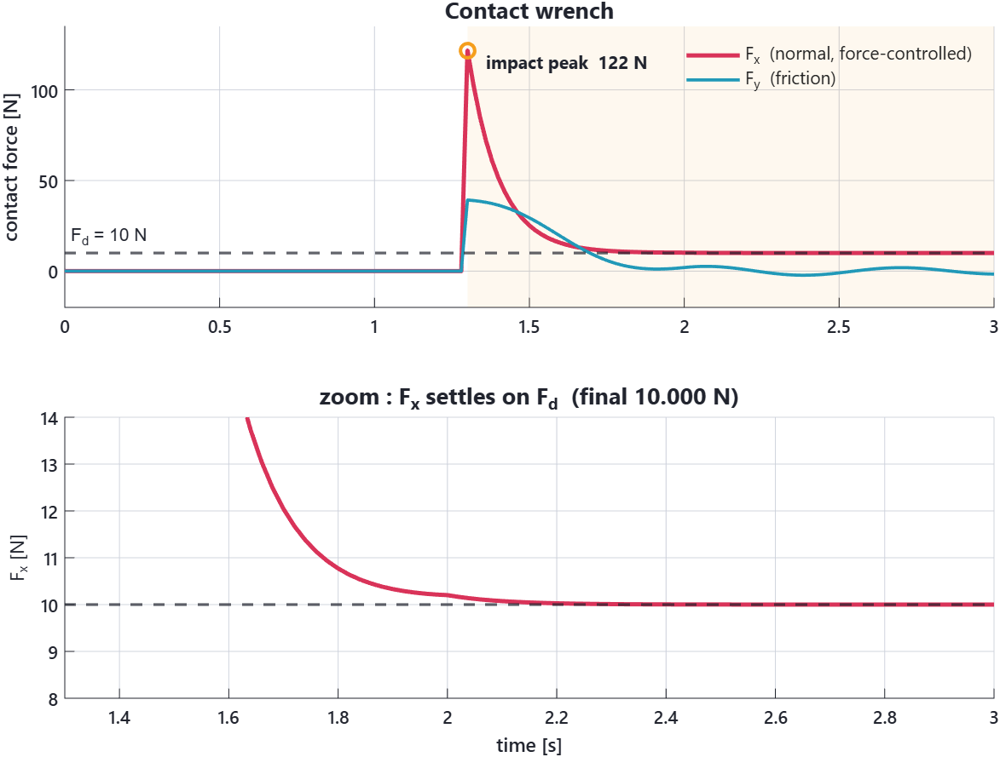
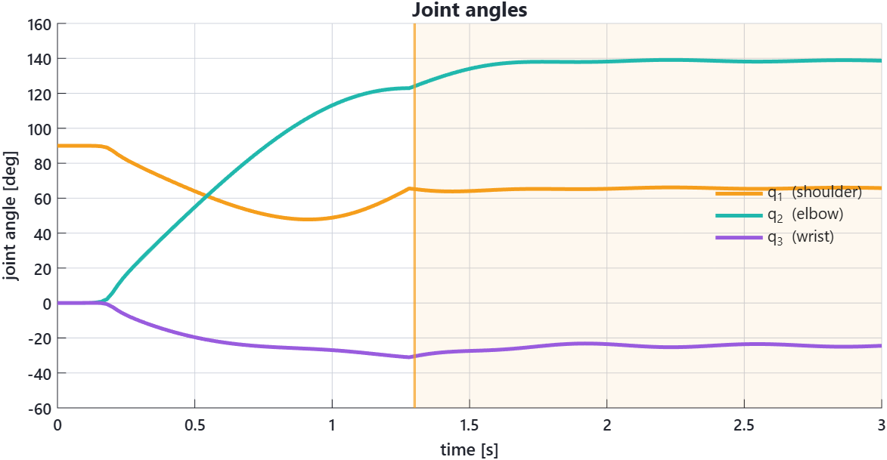
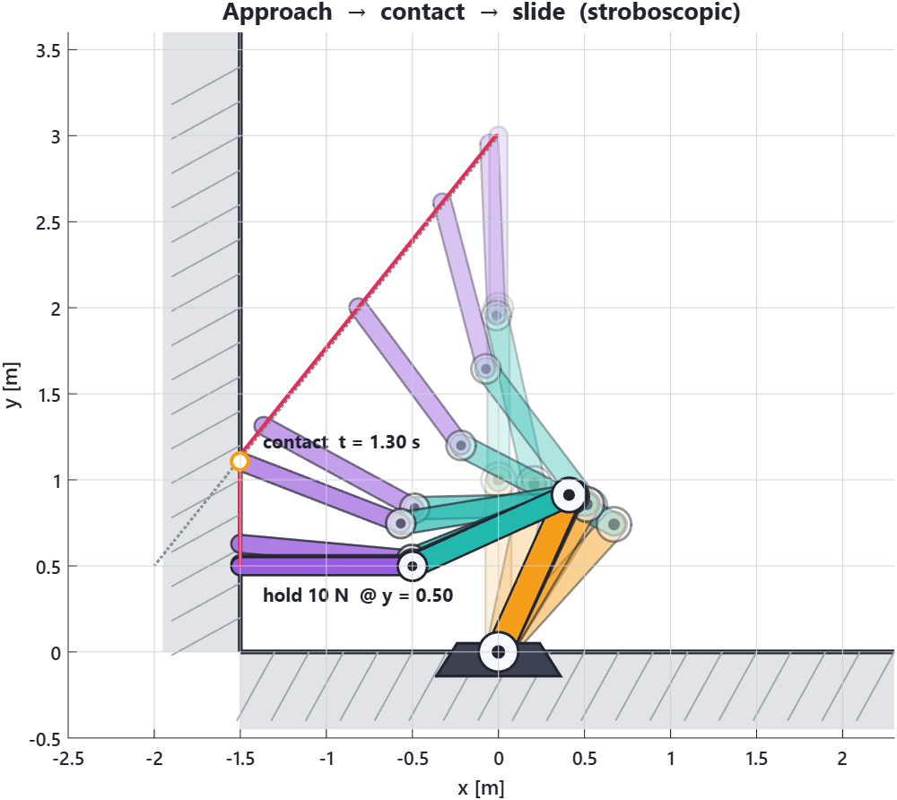

<div align="center">

# 🦾 3-DOF Hybrid Impedance / Force Control

**평면 3링크 로봇팔이 벽에 다가가 · 부딪히고 · 10 N으로 누르며 미끄러져 내려간다**

MATLAB + Simulink 로 만든 하이브리드 힘/위치 제어 시뮬레이션

<br/>


<br/>



<br/>

**접촉 `t = 1.30 s`  ·  충격 피크 `121.8 N`  ·  정상상태 `10.000 N`  ·  벽 침투 `0.01 mm`**

</div>

---

## 📌 한눈에 보기

3링크 로봇팔이 **완전히 펴진 자세**(특이자세)에서 출발해서 왼쪽 벽으로 다가갑니다.
다가가는 동안 툴을 벽에 수직이 되도록 돌리고, 벽에 닿는 순간부터
**x축은 위치가 아니라 "힘"을 제어**로 전환해 10 N을 유지하면서
**y축은 계속 위치 제어**로 벽면을 따라 0.61 m 미끄러져 내려갑니다.

<div align="center">



</div>

| 항목 | 값 | 어디서 나온 값인가 |
|---|---|---|
| 접촉 시각 | **`t = 1.30 s`** | `Fx` 가 처음 0이 아니게 되는 시점 |
| 접촉 높이 | `y = 1.107 m` | 그때의 엔드이펙터 높이 |
| 충격 피크 | **`121.8 N`** | 벽 강성 `k_w = 1e6` 짜리 딱딱한 벽에 부딪힌 순간 |
| 정상상태 힘 | **`10.000 N`** | 목표 `F_d = 10 N` — 오차 0에 수렴 |
| 벽 침투량 | `1.0e-5 m` (0.01 mm) | `F / k_w = 10 / 1e6` — 이론값과 정확히 일치 |
| 미끄러진 거리 | **`0.609 m`** | `y : 1.107 → 0.500` |

---

## 🤖 1. 로봇과 환경

**링크 3개, 모두 균일한 막대(slender rod)**

| 파라미터 | 값 |
|---|---|
| 링크 길이 `L₁ = L₂ = L₃` | `1.0 m` |
| 링크 질량 `m₁ = m₂ = m₃` | `0.5 kg` |
| 무게중심 `L_gi` | `Lᵢ / 2` |
| 관성 `Iᵢ` | `mᵢLᵢ² / 12` |
| 중력 `g` | `9.81 m/s²` |
| 벽 `x_wall` | `-1.5 m` |
| 지면 `y_ground` | `0.0 m` |
| 초기 자세 `q(0)` | `(90°, 0°, 0°)` → `X₀ = [0, 3, 90°]` |
| 목표 자세 `X_f` | `[-2.0, 0.5, 180°]`, `T = 2 s` |

```
        y
        ↑
  ▓▓▓   |
  ▓▓▓   |     ● ← t=0 (0, 3) 완전히 펴진 자세
  ▓▓▓   |     │
  ▓▓▓   |     │
  ▓▓▓ ══╡ ← 접촉 y ≈ 1.11
  ▓▓▓   ↓  미끄러짐 0.61 m
  ▓▓▓ ══╡ ← 최종 y = 0.5, 10 N 유지
  ▓▓▓   |
 ───────┴────────────────→ x
 x=-1.5      지면 y = 0
```

> 목표 `x_f = x_wall − 0.5` 는 **벽 안쪽**입니다.
> 위치제어로는 절대 도달할 수 없는 목표를 일부러 줘서,
> 힘 제어 루프가 "누를 대상"을 갖게 만든 것입니다.

### 순기구학과 자코비안

작업공간을 `X = [x, y, φ]` 로 잡으면 자코비안이 **3×3 정사각행렬**이 됩니다.
2자유도(2×2)에서 쓰던 `ddq = J \ (ddx − J̇ q̇)` 구조를 의사역행렬이나 영공간 항 없이
**그대로** 물려받을 수 있다는 게 이 선택의 핵심입니다.

$$
X=\begin{bmatrix}x\\ y\\ \varphi\end{bmatrix}
=\begin{bmatrix}
L_1\cos q_1+L_2\cos q_{12}+L_3\cos q_{123}\\
L_1\sin q_1+L_2\sin q_{12}+L_3\sin q_{123}\\
q_1+q_2+q_3
\end{bmatrix},
\qquad
\begin{aligned}
q_{12}&=q_1+q_2\\
q_{123}&=q_1+q_2+q_3
\end{aligned}
$$

$$
J(q)=\frac{\partial X}{\partial q}=
\begin{bmatrix}
-L_1s_1-L_2s_{12}-L_3s_{123} & -L_2s_{12}-L_3s_{123} & -L_3s_{123}\\
\;\;L_1c_1+L_2c_{12}+L_3c_{123} & \;\;L_2c_{12}+L_3c_{123} & \;\;L_3c_{123}\\
1 & 1 & 1
\end{bmatrix}
$$

마지막 행이 `[1 1 1]` 인 이유는 평면에서 툴 방향이 그냥 관절각의 합
`φ = q₁+q₂+q₃` 이기 때문입니다. → [`direct_kinematics.m`](Hybridimpedance_3dof/direct_kinematics.m)

---

## ⚙️ 2. 동역학 모델

로봇 방정식은 표준형입니다.

$$
H(q)\,\ddot q + C(q,\dot q)\,\dot q + G(q) \;=\; \tau + J^{\top}F_{ext}
$$

**관성행렬 `H`** — 묶음 파라미터로 정리하면

$$
\begin{aligned}
a_1&=I_1+m_1L_{g1}^2+(m_2+m_3)L_1^2\\
a_2&=I_2+m_2L_{g2}^2+m_3L_2^2\\
a_3&=I_3+m_3L_{g3}^2\\
b_1&=L_1(m_2L_{g2}+m_3L_2)\\
b_2&=m_3L_2L_{g3},\qquad b_3=m_3L_1L_{g3}
\end{aligned}
$$

$$
H=\begin{bmatrix}
a_1{+}a_2{+}a_3{+}2b_1c_2{+}2b_2c_3{+}2b_3c_{23} & \ast & \ast\\
a_2{+}a_3{+}b_1c_2{+}2b_2c_3{+}b_3c_{23} & a_2{+}a_3{+}2b_2c_3 & \ast\\
a_3{+}b_2c_3{+}b_3c_{23} & a_3{+}b_2c_3 & a_3
\end{bmatrix}
$$

(대칭행렬이라 위쪽 삼각은 `∗` 로 생략했습니다. `cᵢ = cos qᵢ`, `c₂₃ = cos(q₂+q₃)`)

**코리올리/원심력 `C`** 는 2자유도처럼 손으로 쓰지 않고
**1종 크리스토펠 기호**로 프로그램이 만들게 했습니다. 링크가 하나 늘면 항이 급격히
늘어나 손계산은 실수가 나기 쉽기 때문입니다.

$$
c_{ijk}=\frac12\left(\frac{\partial H_{ij}}{\partial q_k}+\frac{\partial H_{ik}}{\partial q_j}-\frac{\partial H_{jk}}{\partial q_i}\right),
\qquad
C_{ij}=\sum_{k=1}^{3}c_{ijk}\,\dot q_k
$$

`H` 는 `q₁` 에 의존하지 않으므로 `∂H/∂q₁ = 0` 입니다 (평면 로봇의 성질).
그래서 코드에는 `dH2`, `dH3` 두 개만 실제 값이 들어갑니다.

**중력항 `G`**

$$
\begin{aligned}
G_1&=g\left[m_1L_{g1}c_1+m_2(L_1c_1+L_{g2}c_{12})+m_3(L_1c_1+L_2c_{12}+L_{g3}c_{123})\right]\\
G_2&=g\left[m_2L_{g2}c_{12}+m_3(L_2c_{12}+L_{g3}c_{123})\right]\\
G_3&=g\,m_3L_{g3}c_{123}
\end{aligned}
$$

→ [`Dynamics.m`](Hybridimpedance_3dof/Dynamics.m)

---

## 🎛️ 3. 제어 알고리즘

### 3-1. 뼈대 : 계산토크 + 분해가속도 (Computed Torque + Resolved Acceleration)

작업공간에서 원하는 가속도 `ẍ_cmd` 를 만들고 → 관절가속도로 바꾸고 → 토크로 환산합니다.

$$
\ddot q = J^{-1}\left(\ddot x_{cmd}-\dot J\dot q\right),
\qquad
\boxed{\;\tau = H(q)\,\ddot q + C\dot q + G - J^{\top}F_{ext}\;}
$$

`H, C, G` 가 정확하면 비선형 항이 상쇄되어 작업공간에서 **선형 2차계**만 남습니다.
남은 일은 `ẍ_cmd` 를 어떻게 만드느냐 뿐입니다.

### 3-2. 자유공간 : 순수 위치 제어

$$
\ddot x_{cmd}=\ddot X_d + K_m\left[K_d(\dot X_d-\dot X)+K_p(X_d-X)\right]
$$

`K_m = I`, `K_d = 100·I`, `K_p = I`.

> ⚠️ **주의 (원본 코드에서 그대로 물려받은 이름)** — `K_d` 가 **속도**오차에, `K_p` 가
> **위치**오차에 곱해집니다. 즉 이름과 역할이 서로 바뀌어 있습니다. 값을 보면
> `K_d = 100` 이 실질적인 속도 감쇠 게인입니다. 헷갈리지 않게 여기 적어 둡니다.

### 3-3. 접촉 중 : 하이브리드 힘/위치 제어

`x < x_wall` 이 되는 순간 축마다 **역할이 갈립니다**. 선택행렬 `S` 로 쓰면

$$
S=\mathrm{diag}(1,0,0),\qquad I-S=\mathrm{diag}(0,1,1)
$$

`S` 가 골라내는 축(x)은 **힘**을, `I − S` 가 골라내는 축(y, φ)은 **위치**를 제어합니다.

| 축 | 역할 | 제어 법칙 |
|:--:|---|---|
| **x** | 🔴 **힘 제어** — 벽을 `F_d = 10 N` 으로 누른다 | PI on force |
| **y** | 🔵 위치 제어 — 벽면을 따라 미끄러진다 | PD on position |
| **φ** | 🟣 위치 제어 — 툴을 벽에 수직으로 유지 | PD on orientation |

$$
\begin{aligned}
\ddot x_{f}&=\ddot x_{df}+K_{mf}\Big[K_{df}(\dot x_{df}-\dot x_f)\;-\;\underbrace{A_f\,e_F}_{P}\;-\;\underbrace{B_f\!\!\int\! e_F\,dt}_{I}\Big],
&& e_F=F_d-f_{ext,x} \quad (x)\\[4pt]
\ddot x_{p}&=\ddot x_{dp}+K_{mp}\left[K_{dp}(\dot x_{dp}-\dot x_p)+K_{pp}(x_{dp}-x_p)\right] && (y)\\[4pt]
\ddot x_{o}&=\ddot x_{do}+K_{mo}\left[K_{do}(\dot x_{do}-\dot x_o)+K_{po}(x_{do}-x_o)\right] && (\varphi)
\end{aligned}
$$

힘 루프에 **적분항이 들어간 것이 핵심**입니다. 비례항만 있으면 정상상태 힘 오차가
남지만, 적분항 `B_f∫e_F` 덕분에 `F_x` 가 **정확히 10.000 N** 으로 수렴합니다
(아래 그래프의 zoom 참고). 적분값은 Simulink 의 Integrator 블록이 들고 있고
(`Intf` 신호), `Dynamics.m` 은 매 스텝 `e_F = F_d − f_ext,x` 를 되돌려 줍니다.

| 게인 | 값 | 의미 |
|---|---|---|
| `F_d` | `10 N` | 목표 접촉력 |
| `A_f` / `B_f` | `10` / `100` | 힘 루프의 비례 / 적분 게인 |
| `K_pp`, `K_po` | `100` | y, φ 위치 게인 → `ωₙ = 10 rad/s` |
| `K_dp`, `K_do` | `1` | y, φ 속도 게인 → **`ζ = 0.05`** (매우 부족감쇠) |

> `ζ = 0.05` 라서 접촉 후 `F_y` 에 링잉이 남습니다. `K_dp` 를 10 근처로 올리면
> 임계감쇠가 되지만, 그건 "자유도 확장"이 아니라 "재튜닝"이라 일부러 손대지 않았습니다.

### 3-4. 전체 흐름



---

## 🧱 4. 접촉 모델

### 벽 (스프링–댐퍼 페널티)

$$
f_{ext,x}=-\big[k_w\,(x-x_{wall})+d_w\,\dot x\big],\qquad
f_{ext,y}=-\mu\,\dot y,\qquad n_{ext,z}=0
$$

`k_w = 10⁶ N/m` (아주 딱딱한 벽), `d_w = 10² Ns/m`, `μ = 20`.
점접촉으로 보므로 접촉 모멘트는 0입니다.

**검산** — 정상상태에서 10 N을 유지하려면 침투량이
`δ = F/k_w = 10/10⁶ = 1.0×10⁻⁵ m` 여야 합니다. 시뮬레이션 결과 `x = −1.500010`,
즉 **정확히 0.01 mm** 침투. 모델과 결과가 일치합니다. ✅

### 지면 (팔 전체가 대상)

2자유도 모델에는 지면이 아예 없어서 링크가 `y < 0` 으로 내려가도 그만이었습니다.
지금은 **엔드이펙터만이 아니라 팔 전체**를 막습니다. 각 링크의 중점과 끝점,
총 **6개 접촉점**을 잡고 지면 아래로 내려간 점마다

$$
f_{gy}=\max\Big(-\big[k_g(p_y-y_{ground})+d_g v_y\big],\,0\Big),\qquad
f_{gx}=-\mu_g v_x,\qquad
\tau_g \mathrel{+}= J_p^{\top}\begin{bmatrix}f_{gx}\\ f_{gy}\end{bmatrix}
$$

`max(·, 0)` 은 **단방향 접촉**입니다 — 지면은 밀기만 하고 당기지 않습니다.
`τ_g` 는 제어기가 **보상하지 않는 순수 외란**으로 관절에 더해집니다.
예상치 못한 충돌을 흉내내는 것이니 물리적으로도 이쪽이 맞습니다.

---

## 🌀 5. 특이자세에서 출발하기

초기 자세 `q = (90°, 0°, 0°)` 는 팔이 **완전히 펴진 특이자세**입니다.
`+y` 방향으로 곧게 서 있으면 `J` 의 두 번째 행이 `[1 1 1]·(−1)` 꼴로 축퇴되어
`det J = 0` — 팔은 **자기 축 방향으로 가속할 수 없습니다.** 그냥 역행렬을 취하면 발산합니다.

**대책 1 : 5차(quintic) 궤적** — 3차 다항식은 `s̈(0) = 6/T² ≠ 0` 이라
`t = 0` 에 가속도를 요구합니다. 5차는 시작·끝에서 **속도와 가속도가 모두 0**입니다.

$$
s(\tau)=10\tau^3-15\tau^4+6\tau^5,\qquad \tau=t/T,\qquad
s(0)=\dot s(0)=\ddot s(0)=0
$$

**대책 2 : 감쇠최소자승(DLS) 역행렬** — 최소 특이값이 문턱값 아래로 내려갈 때만
감쇠를 섞습니다.

$$
\lambda^2=\begin{cases}
\lambda_0^2\left[1-\left(\dfrac{\sigma_{min}}{\varepsilon}\right)^{2}\right] & \sigma_{min}<\varepsilon\\[8pt]
0 & \text{otherwise}
\end{cases}
\qquad
\ddot q=\left(J^{\top}J+\lambda^2 I\right)^{-1}J^{\top}\left(\ddot x_{cmd}-\dot J\dot q\right)
$$

`ε = 0.10`, `λ₀ = 0.05`. 특이자세에서 멀어지면 `λ² = 0` 이 되어
원래의 `J \ (ẍ − J̇q̇)` 와 **완전히 같아집니다.** 정확도를 잃지 않으면서 특이점만 막는 방식입니다.

---

## 📊 6. 결과

### 작업공간 자세 — 위치와 방향



- 🔴 `x` 가 `t = 1.30 s` 에 벽(`−1.5`)에 닿은 뒤 **완전히 멈춥니다.** 목표 `x_d` 는
  계속 `−2.0` 까지 내려가지만 따라가지 않습니다 — 위치 추종을 포기하고
  **힘 추종으로 전환**했다는 증거입니다.
- 🔵 `y` 는 접촉 뒤에도 계속 목표를 따라 내려가 `0.5` 에 안착합니다. 같은 순간에
  한 축은 힘, 다른 축은 위치를 제어하는 것 — 이게 하이브리드 제어입니다.
- 🟣 `φ` 는 `90° → 180°` 로 돌아 툴이 벽에 수직이 됩니다.

### 접촉력 — 알고리즘의 핵심 증거



- 딱딱한 벽(`k_w = 10⁶`)에 부딪히는 순간 **121.8 N** 의 충격 피크.
- 힘 루프가 즉시 밀어내며 `t ≈ 2.2 s` 부터 **10.000 N** 에 정착 — 정상상태 오차 0.
  적분항 `B_f∫e_F` 가 하는 일입니다.
- `F_y`(마찰)의 흔들림은 위에서 말한 `ζ = 0.05` 의 부족감쇠 링잉입니다.

### 관절 각도



`t < 0.15 s` 구간이 거의 평평한 것에 주목하세요. 5차 궤적이 가속도를 0에서
부드럽게 키우는 동안, 특이자세를 **천천히 빠져나가는** 구간입니다.

### 전체 동작 (스트로보)

<div align="center">



</div>

점선이 목표 궤적, 실선이 실제 엔드이펙터 궤적입니다.
**벽에서 두 선이 갈라지는 지점**이 곧 위치 제어가 힘 제어에게 x축을 넘겨준 순간입니다.

---

## 📁 7. 파일 구조

```
robotsys/
├── Hybridimpedance_3dof/        ★ 3자유도 (메인)
│   ├── init.m                   파라미터 · 초기자세 · 벽/지면 위치
│   ├── desired.m                5차 다항 궤적 (x, y, φ)
│   ├── circle.m                 원 궤적 (대체 입력)
│   ├── direct_kinematics.m      순기구학 + 3×3 자코비안
│   ├── controller.m             모델 행렬 재구성 (통과 블록)
│   ├── Dynamics.m               ★ 동역학 + 하이브리드 제어 + 접촉 + DLS
│   ├── Impedance_model.mdl      Simulink 모델
│   ├── run.m                    실행 스크립트 (sim → 저장 → 그래프 → 영상)
│   ├── test_avi.m               로봇팔 렌더링 애니메이션
│   ├── data.txt                 시뮬레이션 결과
│   ├── README.md                구조 · 수치 요약 (영문)
│   └── GUIDE.md                 ★ 한국어 상세 설명서
├── docs/
│   ├── make_figures.m           이 README 의 그림 생성 스크립트
│   └── img/                     생성된 PNG / GIF
├── Hybridimpedance/             2자유도 원본
└── Hybridimpedance_re/          2자유도 + 벽 접촉/힘 루프
```

### `data.txt` 열 구성

```
 1     t
 2: 4  x, y, phi          실제 작업공간 자세
 5: 7  xd, yd, phid       목표 작업공간 자세
 8:10  q1, q2, q3         [deg]
11:13  Fx, Fy, Mz         접촉 렌치
```

---

## ▶️ 8. 실행

```matlab
cd Hybridimpedance_3dof
run
```

`run.m` 이 `init` → `sim('Impedance_model')` → `data.txt` 저장 →
`test_avi`(애니메이션) → 그래프 4단 플롯 순서로 진행합니다.

README 의 그림을 다시 만들려면 (시뮬레이션 없이 `data.txt` 만으로 동작):

```matlab
cd docs
make_figures
```

---

## 🔬 9. 2자유도 → 3자유도, 무엇이 달라졌나

| | 2자유도 (`Hybridimpedance_re`) | 3자유도 (여기) |
|---|---|---|
| 관절 | `q₁, q₂` | `q₁, q₂, q₃` |
| 작업공간 `X` | `[x, y]` | `[x, y, φ]` — **툴 방향까지 제어** |
| 자코비안 | 2×2 | 3×3 (여전히 정사각 → 구조 그대로 유지) |
| 코리올리 항 | 손으로 전개 | **크리스토펠 기호로 자동 생성** |
| 지면 | 없음 | 링크 6점 페널티 접촉 |
| 초기 자세 | 일반 자세 | **특이자세** (완전히 펴짐) + quintic + DLS |
| 제어 분할 | x : 힘 / y : 위치 | x : 힘 / y : 위치 / **φ : 자세** |

Simulink 모델에서는 Mux/Demux 폭과 MATLAB Fcn 블록의 출력 차원을 전부 다시 잡아야 합니다.
(`Mux → controller` 는 15 → **22**, `Robot Dynamics` 출력은 13 → **19**)
자세한 표는 👉 [`Hybridimpedance_3dof/README.md`](Hybridimpedance_3dof/README.md)

---

## 🎚️ 10. 만져볼 만한 곳

| 바꿀 값 | 있는 곳 | 무슨 일이 일어나나 |
|---|---|---|
| `F_d` | `Dynamics.m` | 목표 접촉력. 20 N 으로 올리면 침투량도 2배(0.02 mm) |
| `A_f`, `B_f` | `Dynamics.m` | 힘 루프 P/I. `B_f` 를 0으로 하면 정상상태 오차가 남는 걸 볼 수 있음 |
| `K_dp` | `Dynamics.m` | 1 → 10 으로 올리면 `F_y` 링잉이 사라짐 (임계감쇠) |
| `μ` | `Dynamics.m` | 벽 마찰. 크게 하면 미끄러지다 멈춤 |
| `k_w` | `Dynamics.m` | 벽 강성. 낮추면 물렁한 벽 = 충격 피크가 줄어듦 |
| `x_wall` | `init.m` | 벽 위치. 접촉 시각이 바뀜 |
| `desired.m` ↔ `circle.m` | Simulink | 직선 궤적 대신 원 궤적으로 교체 |

---

<div align="center">

📖 **더 자세한 한국어 설명** → [`Hybridimpedance_3dof/GUIDE.md`](Hybridimpedance_3dof/GUIDE.md)

*왜 이렇게 만들었는지, 어떤 오류가 났고 어떻게 고쳤는지까지 정리되어 있습니다.*

</div>
